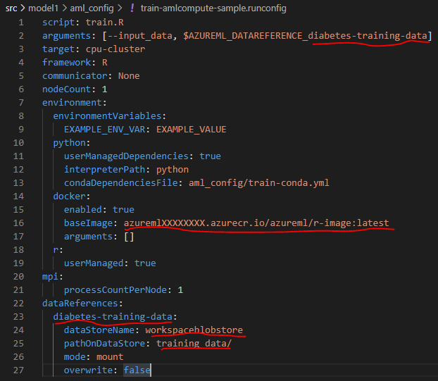

# Training


## Adapt Training Code to Output Trained Model

1. Update your training code to serialize your model
    * Update your training code to write out the model to a directory called `outputs/`
    * Use a method appropriate to your modeling framework to save the trained model to `outputs/`. Adapt your code to something like this:

```r
output_dir <- "outputs"
if (!dir.exists(output_dir)){
  dir.create(output_dir)
}

saveRDS(mod, file = "./outputs/model.rds")
message("Model saved")
```
At the end of a successful experiment run, the contents of `outputs/` will be uploaded into the Workspace from which your model.
## Running training locally

This is the target architecture we'll use for this section:


1. Adapt local runconfig for local training
    * Open [`aml_config/train-local.runconfig`](../src/model1/aml_config/train-local.runconfig) in your editor
    * Update the `script` parameter to point to your entry script (default is `train.R`)
    * Update the `arguments` parameter and point your data path parameter to `/data` and adapt other parameters
    * Under the `environment -> docker` section, change `arguments: [-v, /full/path/to/sample-data:/data]` to the full path to your data folder on your disk
    * If you use the Compute Instance in Azure, copy the files into the instance first and then reference the local path

1. Open `Terminal` in VSCode and run the training against the local instance
    * Select `View -> Terminal` to open the terminal
    * From the root of the repo, attach to the AML workspace:

    ```bash
    $ az ml folder attach -g <your-resource-group> -w <your-workspace-name>
    # Using the defaults from before: az ml folder attach -g aml-demo -w aml-demo
    ```

    * Switch to our model directory:
    
    ```bash
    $ cd src/model1/
    ```

    * Submit the `train-local.runconfig` against the local host (either Compute Instance or your local Docker environment)

    ```bash
    $ az ml run submit-script -c train-local -e aml-poc-local
    ```

    * **Details:** In this case `-c` refers to the `--run-configuration-name` (which points to `aml_config/<run-configuration-name>.runconfig`) and `-e` refers to the `--experiment-name`.
    * If it runs through, perfect - if not, follow the error message and adapt data path, conda env, etc. until it works
    * Your training run will show up under `Experiments` in the UI

## Running training on Azure Machine Learning Compute

This is the target architecture we'll use for this section:


1. Upload data to default AML datastore
    * *Option 1* - Using Azure Storage Explorer:
        * Install [Azure Storage Explorer](https://azure.microsoft.com/en-us/features/storage-explorer/)
        * Navigate into the correct subscription, then select the `Storage Account` that belongs to the AML workspace (should be named similar to the workspace with some random number), then select `Blob Containers` and find the container named `azureml-blobstore-...`
        * In this container, create a new folder for your dataset, in this example is names `diabetes_dataset`
               
        * Upload your data to that new folder
        * **Note:** For production, our data will obviously come from a separate data source, e.g., an Azure Data Lake
    * *Option 2* - Using CLI:
        * Execute the following commands in the terminal:

        ```bash
        $ az storage account keys list -g <your-resource-group> -n <storage-account-name>
        $ az storage container create -n <container-name> --account-name <storage-account-name>
        $ az storage blob upload -f <file_name.csv> -c <container-name> -n file_name.csv --account-name <storage-account-name>
        ```

        * In this case you need to register the container as new Datastore in AML, then create the dataset afterwards

2. Provision Compute cluster in Azure Machine Learning
    * Open [Azure Machine Learning Studio UI](https://ml.azure.com)
    * Navigate to `Compute --> Compute clusters`
    * Select `+ New`
    * Set the `Compute name` to `cpu-cluster`
    * Select a `Virtual Machine type` (depending on your use case, you might want a GPU instance)
    * Set `Minimum number of nodes` to 0
    * Set `Maximum number of nodes` to 1
    * Set `Idle seconds before scale down` to e.g., 7200 (this will keep the cluster up for 2 hours, hence avoids startup times)
    * Hit `Create`
    


3. Adapt AML Compute runconfig
    * Open [`aml_config/train-amlcompute.runconfig`](../src/model1/aml_config/train-amlcompute.runconfig) in your editor
    * Update the `script` parameter to point to your entry script
    * Update the following parameters of the `dataReferences` section:
        * Set a data reference name `<DATA REFERENCE NAME>` on line 23 that will also be used on line 2
        * **Note: do not use underscores or dashes in your** `<DATA REFERENCE NAME>`
        * Set the `dataStoreName` parameter to the AML datastore where your training data exists
        * Set the `pathOnDataStore` parameter to the path in the datastore where your training data exists
    * Update the `arguments` parameter and set `<DATA REFERENCE NAME>` to the same value provided for `<DATA REFERENCE NAME>` on line 23
    * Update the `target` section and point it to the name of your newly created Compute cluster (default `cpu-cluster`)
    * Update the `baseImage` parameter in the `docker` section to the image name and tag created in [01-Renvironment](01-Renvironment.md)
     ```yml
    baseImage: <registry_name>.azurecr.io/<repository>:<tag>
    ```
    See example below:

    


4. Submit the training against the AML Compute Cluster
    * Submit the `train-amlcompute.runconfig` against the AML Compute Cluster
    ```bash
    $ az ml run submit-script -c train-amlcompute -e aml-poc-compute -t run.json
    ```
    * **Details:** The `-t` stands for `--output-metadata-file` and is used to generate a file that contains metadata about the run (we can use it to easily register the model from it in the next step).
    * Your training run will show up under `Experiments` in the UI

## Model registration

1. Register model with metadata from your previous training run
    * Register model using the metadata file `run.json`, which is referencing the last training run:
    ```bash
    $ az ml model register -n demo-model --asset-path outputs/model.rds -f run.json \
      --tag key1=value1 --tag key2=value2 --property prop1=value1 --property prop2=value2
    ```

    * **Details:** Here `-n` stands for `--name`, under which the model will be registered. `--asset-path` points to the model's file location within the run itself (see `Outputs + logs` tab in UI). Lastly, `-f` stands for `--run-metadata-file` which is used to load the file created prior for referencing the run from which we want to register the model from.

Great, you have now trained your Machine Learning on Azure using the power of the cloud. Let's move to the [next section](03-inferencing.md) where we look into moving the inferencing code to Azure.
